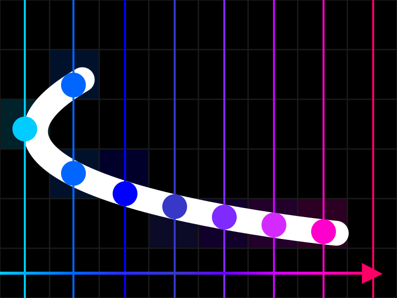

# Drawing bézier curves using a naïve algorithm

> NOTE: This is an article that was written because it *could* be written and not because it *should* be written. Please don't actually use this!

Generally, when you want to draw a curve like a bezier curve, you tesslate it and then use some other line drawing algorithm to draw the segments. But what if you want a pixel perfect algorithm to draw bezier curves instead of just approximating them with line segments?

This can be done! The accepted common way seems to be to use [a modification of Bresenham's line algorithm](http://members.chello.at/easyfilter/bresenham.html) to draw the curve, but there is a simpler way that is similar to the naïve line algorithm.

For now, we will just do a quadratic (2nd degree) bezier since it is simpler to walk through the derivation.

## Finding $t$, given $x$

To start, let's find the $t$-values given an $x$-value. Let's write the $x$-coordinate of our curve:

$$ x = \color{red}(1 - t)^2 x_0\color{reset} + \color{green}2(1 - t)tx_1\color{reset} + \color{blue}t^2x_2\color{reset} $$

Next, let's expand this to be a 2nd degree polynomial (an expression in the form $p(t) = at^2 + bt + c$).

$$ x = \color{red}(1 - t)^2 x_0\color{reset} + \color{green}2(1 - t)tx_1\color{reset} + \color{blue}t^2x_2\color{reset} $$
$$ x = \color{red}(1 - 2t + t^2) x_0\color{reset} + \color{green}2(1 - t)tx_1\color{reset} + \color{blue}t^2x_2\color{reset} $$
$$ x = \color{red}(1 - 2t + t^2) x_0\color{reset} + \color{green}(2t - 2t^2)x_1\color{reset} + \color{blue}t^2x_2\color{reset} $$
$$ x = \color{red}x_0 - 2x_0t + x_0t^2\color{reset} + \color{green}(2t - 2t^2)x_1\color{reset} + \color{blue}t^2x_2\color{reset} $$
$$ x = \color{red}x_0\color{reset} - \color{red}2x_0\color{reset}t + \color{red}x_0\color{reset}t^2 + \color{green}2x_1\color{reset}t - \color{green}2x_1\color{reset}t^2 + \color{blue}x_2\color{reset}t^2 $$
$$ x = \color{red}x_0\color{reset}t^2 - \color{green}2x_1\color{reset}t^2 + \color{blue}x_2\color{reset}t^2 + \color{green}2x_1\color{reset}t - \color{red}2x_0\color{reset}t + \color{red}x_0\color{reset} $$
$$ x = (\color{red}x_0\color{reset} - \color{green}2x_1\color{reset} + \color{blue}x_2\color{reset})t^2 + (\color{green}2x_1\color{reset} - \color{red}2x_0\color{reset})t + \color{red}x_0\color{reset} $$

Notice that if we subtract $x$ from both sides, finding the value of $t$ just turns into a problem of finding the roots of a quadratic:

$$ x = (\color{red}x_0\color{reset} - \color{green}2x_1\color{reset} + \color{blue}x_2\color{reset})t^2 + (\color{green}2x_1\color{reset} - \color{red}2x_0\color{reset})t + \color{red}x_0\color{reset} $$
$$ 0 = (\color{red}x_0\color{reset} - \color{green}2x_1\color{reset} + \color{blue}x_2\color{reset})t^2 + (\color{green}2x_1\color{reset} - \color{red}2x_0\color{reset})t + \color{red}x_0\color{reset} - \color{purple}x\color{reset} $$

So to find any possible values of $t$, we can solve for the roots &mdash; or the values of $t$ that make the entire thing equal to zero. It would make sense to use quadtratic formula (which, if you don't completely understand it, is a generalised variant of [completing the square](https://www.khanacademy.org/math/algebra-home/alg-quadratics/alg-solving-quadratics-by-completing-the-square/v/solving-quadratic-equations-by-completing-the-square)) since it is fast, in which case

$$ a = \color{red}x_0\color{reset} - \color{green}2x_1\color{reset} + \color{blue}x_2\color{reset} $$
$$ b = \color{green}2x_1\color{reset} - \color{red}2x_0\color{reset} $$
$$ c = \color{red}x_0\color{reset} - \color{purple}x\color{reset} $$

that can then be passed to a function that will return the roots.

$$ \text{FindRoots}(a, b, c) = \frac{-b \pm \sqrt{b^2 - 4ac}}{2a} $$

(Or if you must be mathematically percise, a [multivalued function](https://en.wikipedia.org/wiki/Multivalued_function).)

## Filtering $t$-values
Just because we can find some $t$-values that will work does not mean we should use them. What if $t = 1.43$ ? That is out of the normal range of a bezier curve, but is technically perfectly valid so it would create some unexpected results.

We need to place a constraint on the values that we will accept. Thankfully, if you know the basics of bezier curves you know that we just need to accept values in the range $t \in [0, 1]$ and discard anything else.

So, after we get the possible $t$-values for the current $x$-coordinate, we should check if they are in the range [0, 1]

## Finding $y$

Once we know that the $t$-value(s) at this $x$-coordinate is/are valid, we need find the $y$-coordinate for that $t$-value. Hopefully, you know that you can just solve a bezier like normal in order to do that:

$$ y(t) = (1 - t)^2y_0 + 2(1 - t)ty_1 + t^2y_2 $$

## A small problem

> *Still looking for a good solution to the issue, so I don't have one here yet.*

Much like the naïve line algorithm, we run into a problem when the line's derivative (rate of change) is greater than one ($\frac{\Delta y}{\Delta x} > 1$ or $L'(x) > 1$). The solution was simple: swap the $x$ and $y$ values so that this change falls below $1$ again.

Unforunately, it's not as simple as swapping the $x$ and $y$ coordinate for that special case since Bezier curves have variable derivatives and $y'(x)$ might fall above or below.

<!-- Keep in mind that Bezier curves typically are not expressed as a function of $x$ but as a function of a parameter $t$ so normally the derivative is a vector $\vec{v}$ with respect to $t$ like $\frac{d\vec{v}(t)}{dt}$. -->

## Building the algorithm

You can find a full implementation in <a href="https://github.com/knot126/Melon/blob/trunk/src/bitmap.c#L380"><code>bitmap.c</code></a>.