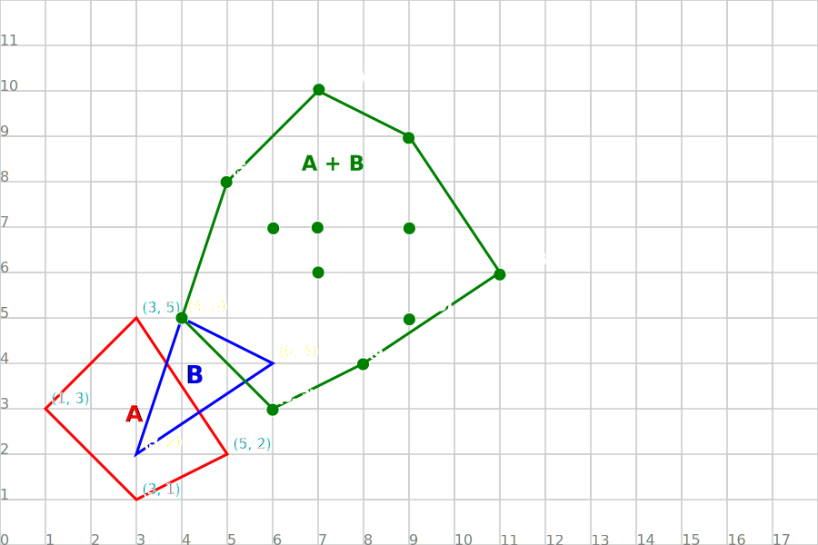

# Minkowski sums and differences

**Minkowski sums** and **differences** are used in collision detection algorithms like GJK and EPA becuase &mdash; very loosely speaking &mdash; they can do a sort of "root finding" operation for polygons.

## But what is a Minkowski sum?

Formally, it is the set of each point in polygon $A$ added to each point in polygon $B$, as if they were put into a table:

| $+$   | $A_0$ | $A_1$ | $\cdots$ | $A_n$ |
| ----- | ----- | ----- | -------- | ----- |
| $B_0$ | $A_0 + B_0$ | $A_1 + B_0$ | $\cdots$ | $A_n + B_0$ |
| $B_1$ | $A_0 + B_1$ | $A_1 + B_1$ | $\cdots$ | $A_n + B_1$ |
| $\vdots$ | $\vdots$ | $\vdots$ | $\ddots$ | $\vdots$ |
| $B_m$ | $A_0 + B_m$ | $A_1 + B_m$ | $\cdots$ | $A_n + B_m$ |

If it helps, you can think of it like an "image filter" or a convolution, just instead of doing things with pixels you are doing it with points in a polygon.

And of course, the same thing applies for the minkowski difference, just with subtraction instead of addition:

| $-$   | $A_0$ | $A_1$ | $\cdots$ | $A_n$ |
| ----- | ----- | ----- | -------- | ----- |
| $B_0$ | $A_0 - B_0$ | $A_1 - B_0$ | $\cdots$ | $A_n - B_0$ |
| $B_1$ | $A_0 - B_1$ | $A_1 - B_1$ | $\cdots$ | $A_n - B_1$ |
| $\vdots$ | $\vdots$ | $\vdots$ | $\ddots$ | $\vdots$ |
| $B_m$ | $A_0 - B_m$ | $A_1 - B_m$ | $\cdots$ | $A_n - B_m$ |

If you wanted to, you could probably come up with "Minkowski operations" that apply for any operation on vectors or points, but these are the ones most useful for us.

## A quick visualisation

Before we move on, we should probably get a visual idea of what some sums and differences looks like. It will help us think about how this is relevant to collision detection:

### Sum

### Difference (not colliding)

<!---->

### Difference (colliding)

<!---->